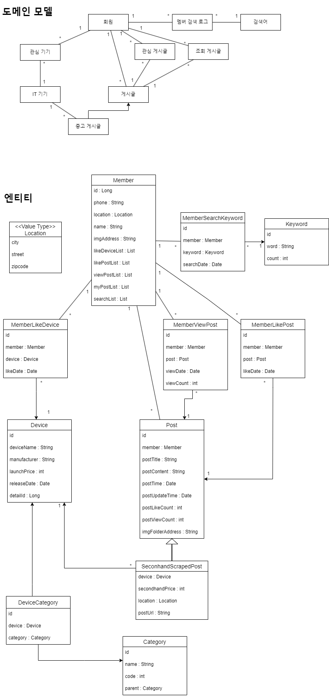

# ITGO
중고거래 통합 모바일 애플리케이션

### Update

- 2024
  - 배포
    - Nginx로 로드밸런싱하여 블루/그린 방식의 무중단 배포 파이프라인 구축
  - [API 명세서](https://iamjeonjuho.notion.site/API-Doc-bc06ae45699542618be24db7850c249d?pvs=74) 작성
  - 리팩터링
    - 적절한 HTTP 메서드와 URL 적용
    - 모든 응답 데이터를 json 객체 타입으로 반환하기 위해 공통 ResponseDTO<T>를 적용
    - 전역 예외처리 적용
  - 테스트 코드
    - 단위 테스트 코드 작성
      - Repository
      - Service
      - Controller
    - 단위 테스트 리팩터링
      - Controller
        - 상태 검증 -> 행위 검증
      - Service, Repository
        - Stub 객체를 생성하는 팩토리 클래스 사용

 

#### Backend System Architecture

 

#### Backend Deploy Architecture

 

#### ERD

 

<b> Features </b>

 

##### 애플리케이션 서버

- 회원
  - 회원가입 
- `프로필`
  - 프로필 조회
  - 프로필 수정
- `기기`
  - 전체 기기 리스트 조회
  - 기기 카테고리 조회
  - 카테고리별 기기 리스트 조회
  - 모바일 기기 정보 조회
  - 노트북 기기 정보 조회
- `중고 게시글`
  - 전체 게시글 리스트 조회
  - 좋아요한 게시글 리스트 조회
  - 카테고리별 게시글 리스트 조회
  - 위치별 게시글 리스트 조회
  - 게시글 세부 조회
  - 게시글 검색
    - 키워드로 검색
    - 최근 검색 키워드 리스트 조회
    - 검색 순위 조회
- `관심`
  - 관심 기기 등록
  - 관심 게시글 등록
  - 관심 위치 등록
  - 관심 기기 삭제
  - 관심 게시글 삭제
  - 관심 위치 삭제
  - 관심 기기 리스트 조회
  - 관심 게시글 리스트 조회
  - 관심 위치 리스트 조회
  - 관심 기기 검색
  - 관심 위치 검색

 

`중고 거래 게시글 스크래퍼`
- 중고 거래 게시글 스크래핑
  - 게시글에서 GPT를 사용해 제품명 추출
  - 중복을 제외한 게시글 데이터베이스에 저장

 

> 제가 구현한 기능을 표시했습니다.

